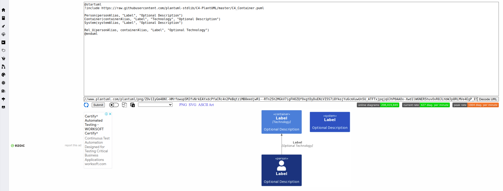
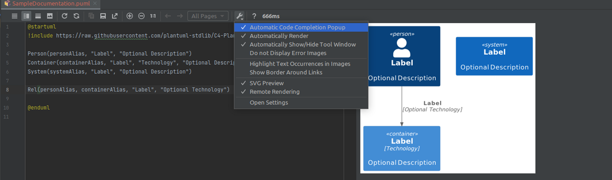

# Diagram Documentations
Author: [Irvin Gil](https://github.com/IrvinGil)

This is a repository housing the documentation files that can be rendered using plantUML software. Advice of usage is to use the PlantUML integration plugin of the intelliJ IDE and allow remote rendering for easy rendering on the IDE level. 

### How to use | Syntax

Refer to [this repository](https://github.com/plantuml-stdlib/C4-PlantUML#c4-plantuml) on how to use and the proper syntax of using C4-PlantUML for making diagram documentation.

You can render the PlantUML code on their web server renderer [here](https://www.plantuml.com/plantuml/uml/ZOv1IyGm48Nl-HMrfowupSMJfvNrkEAYxdcPfaCRc4n2PeBqtziMB8eedjwR1--RTn25h2MGkV7igFHOZQf9xgtDyDuENiVI5S7i8YkojYu6cmXuwUn5U_ATFTxjpqjqUJhP0AAOv-Xwd1lW6NER5huvOvR8JLhbWJp8RLMVe4EgP_ESr4S6gXvHNFRhLU_C1cdSf_jHVKCtSgGuJ7-0NYTH38siyj_lvWNfUla-UTlnE-JBe9qv8FSbq0S0).

### How to set up on IDE

Follow the steps on this [repository](https://github.com/stawirej/c4-intellij-live-template) for PlantUML IntelliJ Live Template.

- Install the PlantUML integration plugin of intelliJ and restart the IDE.

  > Note: You also need to have Graphviz installed on your local machine in order to render the diagram. To install it, follow these [instructions](https://plantuml.com/graphviz-dot#:~:text=your%20GraphViz%20executable.-,Installation%20under%20Linux,-There%20are%20multiple) and restart the IDE once Graphviz is installed.

- Create a `.puml` file and test integration of the IDE.

### Issues with setting up PlantUML integration in IntelliJ

**For quick fix:**

Make sure that Graphviz is installed and click on the *wrench icon on the IDE → and allow remote rendering.

---
Refer to this [stackoverflow forum](https://stackoverflow.com/questions/54413962/cant-render-component-diagram-with-plantuml-in-intellij) for some answers..
